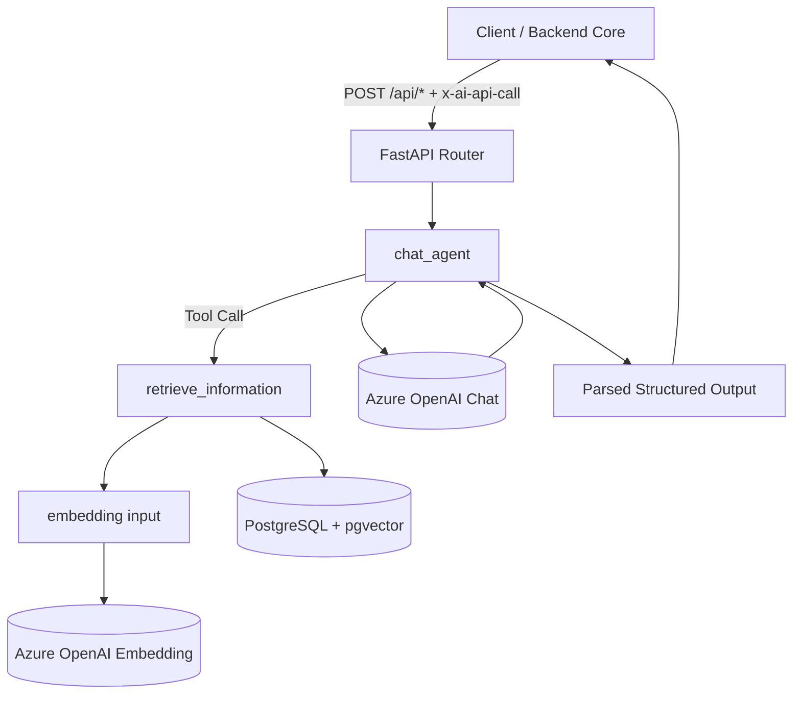

# BeinBout AI Service (FastAPI)

<p align="center">
  
  
  
  
  
  
  
</p>

Repository ini adalah **AI Service Backend** untuk aplikasi BeinBout.
Fungsinya: menjalankan analisis psikologis berbasis **LLM + Tool Calling + RAG** untuk:

- Initial Persona
- Daily Journal Reflection
- Weekly Checkup Analysis

---

## Team ID: CC26 - PS072

1. CFS250D6Y309 - Muhamad Nadira Fabyansyah (Project Manager & AI Engineer)
2. CFS134D6Y504 - Agung Arya Dwipa Laksana (Back-end Developer)
3. CFS134D6Y415 - Kaka Kendra Nugraha (Front-end Developer)
4. CFS296D6Y591 - Muhammad Irfan Daffa' Ardianto (Front-end Developer)
5. CFS134D6Y584 - Denisyal Hendra Putra (Front-end Developer)

---

## Core Features

- **Structured LLM Output (Pydantic)**: response AI diparse ke schema ketat.
- **Mandatory RAG Tool Calling**: model diarahkan selalu memanggil `retrieve_information` sebelum final answer.
- **Vector Retrieval**: embedding via Azure OpenAI + similarity search pgvector HNSW.
- **Secured API Call**: header `x-ai-api-call` wajib untuk route `/api/*`.
- **Health Endpoint**: `GET /health` untuk readiness check.

---

## Tech Stack

| Layer | Stack |
|---|---|
| Runtime | Python 3.12 |
| API Framework | FastAPI |
| Data Validation | Pydantic v2 |
| ORM | SQLModel + SQLAlchemy |
| Vector Store | PostgreSQL + pgvector |
| LLM/Embedding | Azure OpenAI |
| Logging | Loguru |
| Container | Docker |

---

## High-Level Architecture



---

## Struktur Folder

```text
AI FastAPI - Production/
├── main.py
├── requirements.txt
├── Dockerfile
├── api/
│   ├── deps.py
│   └── route/
│       ├── initial_persona.py
│       ├── daily_journal.py
│       └── weekly_checkup.py
├── core/
│   ├── config.py
│   ├── database.py
│   └── ai/
│       ├── llm_agent.py
│       └── embed.py
├── models/
│   └── rag_db.py
├── schemas/
│   ├── payload_initial_persona.py
│   ├── payload_daily_journal.py
│   ├── payload_weekly_checkup.py
│   ├── llm_initial_persona.py
│   ├── llm_daily_journal.py
│   ├── llm_weekly_checkup.py
│   └── llm_tool_calling.py
└── utils/
    ├── rag_search.py
    └── ai/
        ├── create_tool.py
        ├── execute_tool.py
        ├── tool.py
        └── tools/
            └── retrieve_information.py
```

---

## Environment Variables

Copy dari `.env.example`:

```env
# Project Setting
BEINBOUT_AI_CALL_KEY=""
SERVICE_MODE="development"   # development | production

# PostgreSQL PGVector
DATABASE_URL=""

# Azure Foundry AI Service
AZURE_AI_KEY_CREDENTIALS=""
AZURE_AI_ENDPOINT=""
AZURE_AI_API_VERSION=""

AZURE_AI_EMBEDDING_MODEL_NAME=""
AZURE_AI_EMBEDDING_DEPLOYMENT=""

AZURE_AI_LLM_MODEL_NAME=""
AZURE_AI_LLM_DEPLOYMENT=""
```

> Di implementasi saat ini, model yang dipakai oleh service adalah `AZURE_AI_LLM_MODEL_NAME` dan embedding model adalah `AZURE_AI_EMBEDDING_MODEL_NAME`.

---

## Local Development

### 1) Prasyarat
- Python 3.12+
- PostgreSQL + extension `vector`
- Azure OpenAI credentials

### 2) Install

```bash
git clone https://github.com/BeinBout/Project-Capstone-AI.git
cd "Project-Capstone-AI"
python -m venv .venv
source .venv/bin/activate
pip install -r requirements.txt
```

### 3) Run

```bash
uvicorn main:app --reload --host 0.0.0.0 --port 8000
```

Endpoints:
- API Base: `http://localhost:8000`
- Swagger: `http://localhost:8000/docs`
- ReDoc: `http://localhost:8000/redoc`
- Health: `http://localhost:8000/health`

---

## 🐳 Docker

```bash
docker build -t beinbout-ai-service .
docker run --rm -p 8000:8000 --env-file .env beinbout-ai-service
```

---

## Request Security

Semua endpoint `/api/*` wajib mengirim header:

```http
x-ai-api-call: <BEINBOUT_AI_CALL_KEY>
```

Jika invalid → `403 Request Forbidden`.

---

## API Endpoints + JSON Schema

> Detail schema berikut diringkas dari Pydantic model pada folder `schemas/`.

### 1) `POST /api/initial_persona`

**Request JSON Schema (ringkas):**

```json
{
  "type": "object",
  "required": ["user_context", "answers", "total_score", "dominant_categories"],
  "properties": {
    "user_context": {
      "type": "object",
      "required": ["umur", "berat_badan", "tinggi_badan", "bmi_calc"],
      "properties": {
        "umur": { "type": "integer", "minimum": 0, "maximum": 120 },
        "berat_badan": { "type": "integer", "exclusiveMinimum": 0 },
        "tinggi_badan": { "type": "integer", "exclusiveMinimum": 0 },
        "bmi_calc": { "type": "number", "exclusiveMinimum": 0 }
      }
    },
    "answers": {
      "type": "array",
      "items": {
        "type": "object",
        "required": ["category", "question_text", "selected_option", "emotion_tag", "score_value"],
        "properties": {
          "category": { "type": "string" },
          "question_text": { "type": "string" },
          "selected_option": { "type": "string" },
          "emotion_tag": { "type": "string" },
          "score_value": { "type": "integer" }
        }
      }
    },
    "total_score": { "type": "integer" },
    "dominant_categories": { "type": "array", "items": { "type": "string" } }
  }
}
```

**Response shape (ringkas):**
- `ai_summary: string`
- `ai_insights: { risk_level, risk_score, dominant_stressor[], personality_summary, recommendations[], progress_status, weekly_insight, ai_low_confidence }`

---

### 2) `POST /api/daily_journal`

**Request JSON Schema (ringkas):**

```json
{
  "type": "object",
  "required": ["user_context", "current_persona", "journal"],
  "properties": {
    "user_context": {
      "type": "object",
      "required": ["umur", "berat_badan", "tinggi_badan"],
      "properties": {
        "umur": { "type": "integer" },
        "berat_badan": { "type": "integer" },
        "tinggi_badan": { "type": "integer" }
      }
    },
    "current_persona": {
      "type": "object",
      "required": ["risk_level", "risk_score", "dominant_stressor"],
      "properties": {
        "risk_level": { "type": "string" },
        "risk_score": { "type": "integer" },
        "dominant_stressor": { "type": "array", "items": { "type": "string" } }
      }
    },
    "recent_trend": {
      "type": ["object", "null"],
      "properties": {
        "last_3_days_avg_mood": { "type": "number" },
        "last_3_days_avg_sleep": { "type": "number" },
        "consecutive_negative_days": { "type": "integer" }
      }
    },
    "journal": {
      "type": "object",
      "required": ["mood", "mood_intensity", "sleep_duration_hours", "sleep_quality", "content"],
      "properties": {
        "mood": { "type": "string" },
        "mood_intensity": { "type": "integer" },
        "sleep_duration_hours": { "type": "number" },
        "sleep_quality": { "type": "string" },
        "content": { "type": "string" }
      }
    }
  }
}
```

**Response shape (ringkas):**
- `ai_reflection: string`
- `ai_tags: string[] (max 3)`
- `ai_sentiment_score: number (-1.0 s/d 1.0)`
- `ai_anomaly_detected: boolean`
- `ai_anomaly_type: "sleep_deficit" | "mood_drop" | "stress_spike" | null`
- `ai_low_confidence: boolean`

---

### 3) `POST /api/weekly_checkup`

**Request JSON Schema (ringkas):**

```json
{
  "type": "object",
  "required": ["user_context", "current_persona", "weekly_metrics", "checkup_answers", "dominant_categories"],
  "properties": {
    "user_context": {
      "type": "object",
      "required": ["umur", "berat_badan", "tinggi_badan"],
      "properties": {
        "umur": { "type": "integer" },
        "berat_badan": { "type": "integer" },
        "tinggi_badan": { "type": "integer" }
      }
    },
    "current_persona": {
      "type": "object",
      "required": ["risk_level", "risk_score", "dominant_stressor", "personality_summary"],
      "properties": {
        "risk_level": { "type": "string" },
        "risk_score": { "type": "integer" },
        "dominant_stressor": { "type": "array", "items": { "type": "string" } },
        "personality_summary": { "type": "string" }
      }
    },
    "weekly_metrics": {
      "type": "object",
      "required": ["avg_mood_intensity", "avg_sleep_hours", "dominant_mood", "negative_sentiment_ratio", "journal_entries_count", "anomaly_count"],
      "properties": {
        "avg_mood_intensity": { "type": "number" },
        "avg_sleep_hours": { "type": "number" },
        "dominant_mood": { "type": "string" },
        "negative_sentiment_ratio": { "type": "number" },
        "journal_entries_count": { "type": "integer" },
        "anomaly_count": { "type": "integer" }
      }
    },
    "checkup_answers": {
      "type": "array",
      "items": {
        "type": "object",
        "required": ["category", "question_text", "selected_option", "emotion_tag", "score_value"],
        "properties": {
          "category": { "type": "string" },
          "question_text": { "type": "string" },
          "selected_option": { "type": "string" },
          "emotion_tag": { "type": "string" },
          "score_value": { "type": "integer" }
        }
      }
    },
    "dominant_categories": { "type": "array", "items": { "type": "string" } }
  }
}
```

**Response shape (ringkas):**
- `ai_summary: string`
- `ai_insights: { risk_level, risk_score, dominant_stressor[], personality_summary, recommendations[], progress_status, weekly_insight, ai_low_confidence }`

---

## Database Schema

### Table: `rag_db`

| Column | Type | Constraint | Keterangan |
|---|---|---|---|
| `id` | integer | PK, auto increment | ID dokumen |
| `content` | text | NOT NULL | Teks chunk knowledge base |
| `embedding` | vector(1536) | NOT NULL | Embedding vector |
| `extra_info` | jsonb | default `{}` | Metadata dokumen |
| `source_type` | varchar(50) | NOT NULL | Sumber dataset |
| `created_at` | timestamptz | default `now()` | Timestamp insert |

### Index & Extension

- Extension: `CREATE EXTENSION IF NOT EXISTS vector`
- Index:

```sql
CREATE INDEX IF NOT EXISTS ix_rag_db_embedding_hnsw
ON rag_db USING hnsw (embedding vector_ip_ops)
```

---

## Developer Notes

- Logging level:
  - `development` → `DEBUG`
  - selain itu → `WARNING`
- CORS saat ini masih `allow_origins=["*"]`.

---

## Production Readiness Checklist (Recommended)

- Restrict CORS origin ke domain FE resmi.
- Simpan secrets di secret manager (bukan plain `.env` di server).
- Tambahkan rate limit + WAF/API gateway policy.
- Observability: metrics, tracing, error alert.
- Buat pipeline ingestion RAG yang repeatable (chunking, embed, upsert, dedup).

---

## Catatan

README ini fokus ke **AI Service** (bukan Core Backend utama). Jadi dokumentasi endpoint dan schema di sini khusus untuk pipeline analitik AI BeinBout.